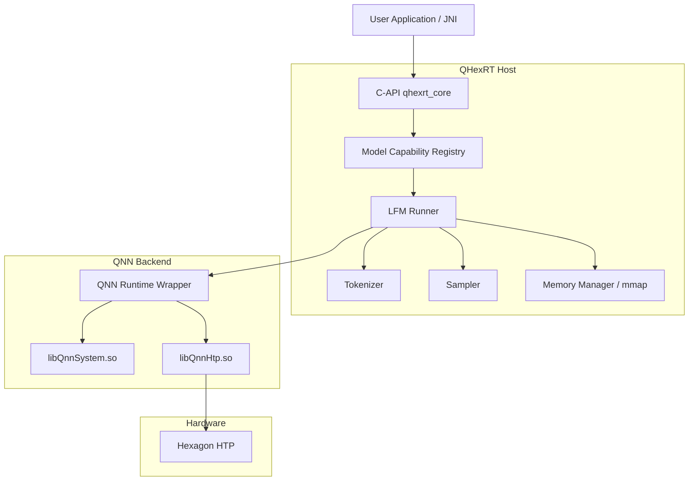
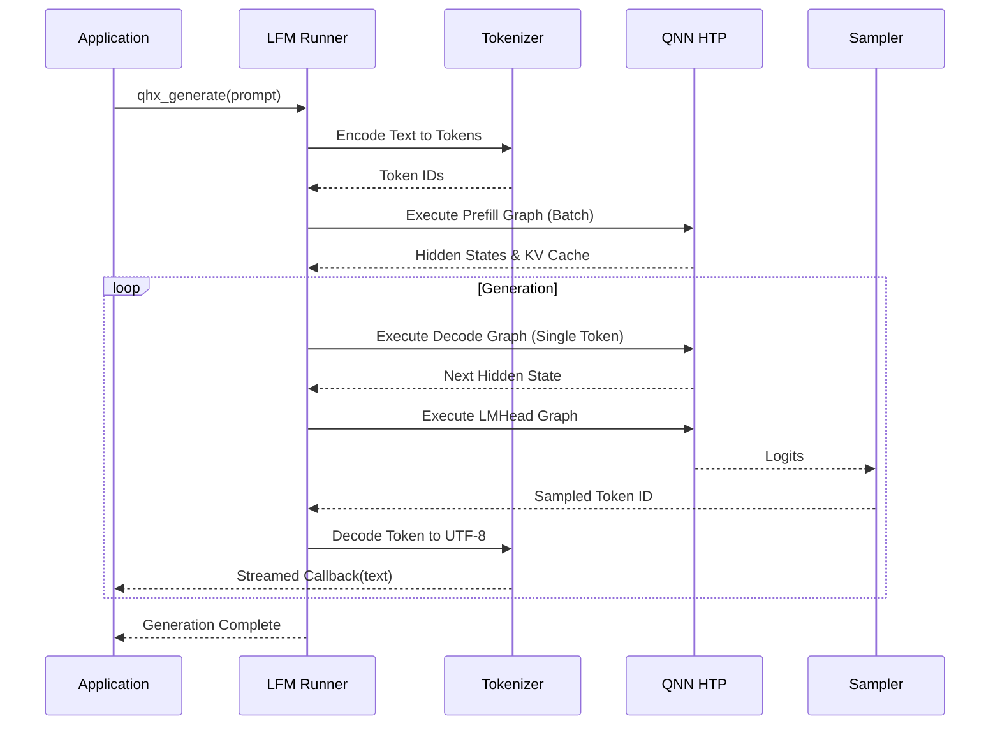

# QHexRT Detailed Architecture

QHexRT is a high-performance inference runtime optimized for Large Foundation Models (LFM) on Qualcomm Hexagon DSPs. This document provides a deep dive into its component design, memory model, and execution pipeline.

## 1. System Components

The runtime is structured into three primary layers:

### 1.1 Interface Layer (`qhexrt_core`)
- **Stability**: Provides a stable C ABI (`qhexrt_c.h`) to ensure compatibility across different Android NDK versions and languages (C++, Java/JNI, Rust).
- **Session Isolation**: Manages opaque handles for `qhx_runtime`, `qhx_model`, and `qhx_session` to ensure thread safety and resource isolation.
- **Model Capability Registry**: Owns typed model IDs, architecture masks,
  support states, runner kinds, and graph-contract identities. Manifest loading
  resolves through this registry before any artifacts or QNN graphs are opened.

### 1.2 Orchestration Layer (`qhexrt_host`)
- **LFM Runner**: The central state machine. It manages the transition between **Prefill** (batch processing) and **Decode** (recurrent generation). It maintains the logical KV-cache state and conversation history.
- **Tokenizer**: Implements efficient Byte-Pair Encoding (BPE) or SentencePiece decoding. It handles special tokens, chat templates, and UTF-8 stream reconstruction.
- **Sampler**: High-performance CPU implementation of nucleus sampling (Top-P), Top-K, Temperature scaling, and repetition penalties.

### 1.3 Hardware Abstraction Layer (`qnn_runtime`)
- **QNN Integration**: Interfaces with `libQnnHtp.so` and `libQnnSystem.so`.
- **Graph Management**: Loads and manages multiple HTP graphs (Prefill, Decode, LMHead).
- **Shared Context Ownership**: Multiple graph handles can share one
  deserialized QNN context. The V79 LFM2.5-350M prefill and decode graphs use
  this path so the approximately 581 MB body context is not loaded twice.
- **Tensor Binding**: Implements zero-copy memory sharing between CPU and DSP using QNN's RPC/Ion memory allocators.

---

## 2. Visual Architecture

### 2.1 Component Diagram

### 2.2 Inference Pipeline

---

## 3. Memory & Performance Optimizations

### 3.1 Graph Splitting
LFM models are split into three distinct graphs to maximize HTP utilization:
1.  **Prefill Graph**: Processes multiple tokens in parallel. Optimized for maximum throughput during the initial prompt processing.
2.  **Decode Graph**: Processes exactly one token. Optimized for minimum latency (Time-to-First-Token and Inter-Token Latency).
3.  **LMHead Graph**: Segregated to allow the host to perform complex sampling or logit manipulation without re-running the full backbone.

The prefill and decode sequence capacities are independent typed dimensions.
For the V79 LFM2.5-350M/2048 contract, prefill processes up to 512 tokens while
decode owns a 2048-token KV state. Prefill KV outputs are copied into the prefix
of the larger decode buffers; equal-sized contracts retain the existing
buffer-swap fast path.

### 3.2 Memory Mapping (mmap)
Weights and serialized graph artifacts are loaded via `mmap(PROT_READ)`.
- **Low RAM footprint**: Only the parts of the model being actively used by the DSP driver are paged into physical memory.
- **Fast Loading**: Eliminates the need for explicit `read()` calls and double buffering.

### 3.3 Zero-Copy Tensor Binding
Instead of copying data between CPU and DSP memory spaces:
- QHexRT allocates tensors in shared memory regions.
- The host and the HTP access the same physical pages, significantly reducing the overhead for high-frequency "Decode" iterations.
