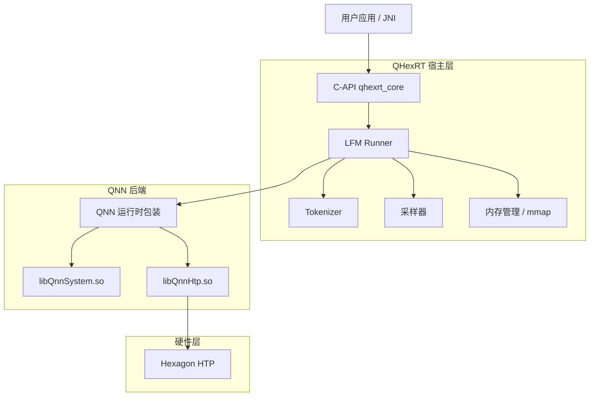
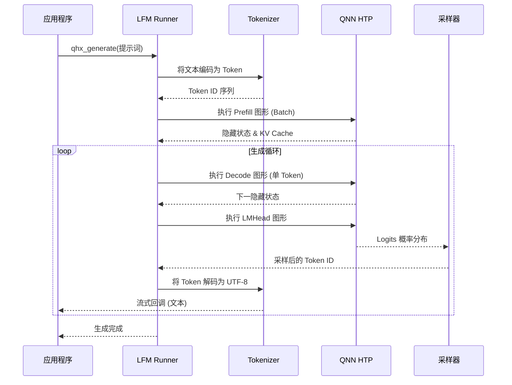

# QHexRT 详细架构说明

QHexRT 是专为高通 Hexagon DSP 优化的高性能大基座模型（LFM）推理运行时。本文档深入探讨其组件设计、内存模型及执行流水线。

## 1. 系统组件

运行时结构分为三个主要层级：

### 1.1 接口层 (`qhexrt_core`)
- **稳定性**：提供稳定的 C ABI (`qhexrt_c.h`)，确保跨不同 Android NDK 版本和语言（C++、Java/JNI、Rust）的兼容性。
- **会话隔离**：通过不透明句柄（Opaque Handles）管理 `qhx_runtime`、`qhx_model` 和 `qhx_session`，确保线程安全和资源隔离。

### 1.2 编排层 (`qhexrt_host`)
- **LFM Runner**：核心状态机。管理 **Prefill**（批处理）与 **Decode**（循环生成）之间的切换。维护逻辑 KV-Cache 状态及对话历史。
- **Tokenizer**：实现高效的 BPE 或 SentencePiece 解码。处理特殊 Token、对话模板（Chat Templates）及 UTF-8 流重组。
- **Sampler（采样器）**：在 CPU 上实现高性能的 Nucleus Sampling (Top-P)、Top-K、Temperature 缩放及重复惩罚逻辑。

### 1.3 硬件抽象层 (`qnn_runtime`)
- **QNN 集成**：对接 `libQnnHtp.so` 和 `libQnnSystem.so`。
- **图形管理**：加载并管理多个 HTP 图形（Prefill、Decode、LMHead）。
- **张量绑定**：利用 QNN 的 RPC/Ion 内存分配器，实现 CPU 与 DSP 之间的零拷贝内存共享。

---

## 2. 架构图解

### 2.1 组件关系图

### 2.2 推理流水线

---

## 3. 内存与性能优化

### 3.1 图形切分 (Graph Splitting)
LFM 模型被切分为三个独立的图形，以最大化 HTP 利用率：
1.  **Prefill 图形**：并行处理多个 Token。针对初始提示词处理时的最大吞吐量进行优化。
2.  **Decode 图形**：仅处理一个 Token。针对最小延迟（首字延迟和 Token 间延迟）进行优化。
3.  **LMHead 图形**：独立切分，允许宿主侧在不重新运行完整骨干网络的情况下，进行复杂的采样或 Logit 操作。

### 3.2 内存映射 (mmap)
权重和序列化的图形工件通过 `mmap(PROT_READ)` 加载。
- **低内存占用**：只有 DSP 驱动程序实际使用的模型部分会被分页到物理内存中。
- **快速加载**：消除了显式的 `read()` 调用和双重缓冲。

### 3.3 零拷贝张量绑定 (Zero-Copy)
无需在 CPU 和 DSP 内存空间之间复制数据：
- QHexRT 在共享内存区域分配张量。
- 宿主侧和 HTP 访问相同的物理内存页，显著降低了高频 "Decode" 迭代的开销。
